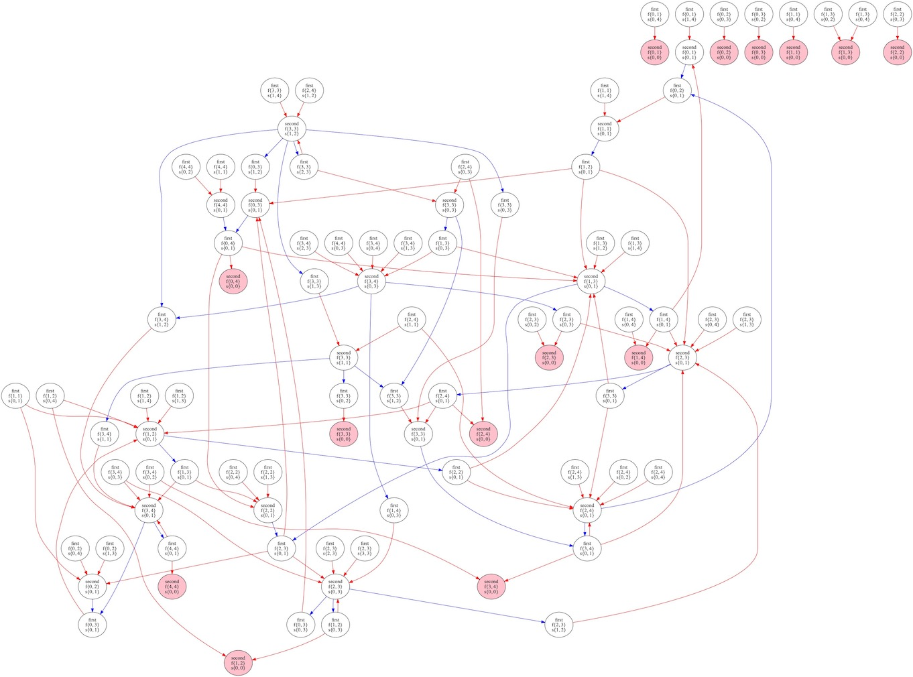

# finger-game-solver



## 概要
プレイヤーが指の本数を交互に増やしていく、例の手遊びゲームを全探索するプログラムです。地域によって「マッチ棒」「割り箸」「電信棒」と言うとか言わないとか...  
必勝となる状態遷移のグラフ、および千日手となる状態遷移のグラフをdot言語で出力します。

## 依存関係
- bash
- g++
- graphviz(dot)
- make

## 使い方
### プログラムのビルドと実行
```
git clone https://github.com/roodni/finger-game-solver.git
cd finger-game-solver
make run
```

ゲームのルールを入力すると、dotディレクトリにグラフがdot言語で出力され、graphディレクトリにgraphvizでpdf化されたグラフが出力されます。

### コマンドの詳細
| コマンド名 | 説明 |
| --- | --- |
| `make all` | プログラムをコンパイルし、a.outを作成します。a.outはゲームのルールを標準入力で受け取り、ゲームの探索結果のグラフをdot言語で記述したテキストファイルをdotディレクトリに出力し、ファイル名を標準出力に１行ずつ出力するプログラムです。
| `make run` | プログラムをコンパイルして実行し、出力されたdotファイルをgraphvizでpdf化してgraphディレクトリに出力します。


## グラフの見方
グラフの各ノードはゲームの状態に対応しています。ノードのラベルからゲームの状態を読むことができます。例を次に示します:
```
first
f{1, 2}
s{3, 4}
```
1行目はそのターンに行動できるプレイヤーを指します。先攻は"first"、後攻は"second"です。  
2行目、3行目はそれぞれ先攻、後攻のプレイヤーの指の本数を表しています。ここで、{1,2}と{2,1}など左右の指が反転した状態は同じ状態として扱われます。

赤色の矢印は先攻プレイヤーの選択を、青色の矢印は後攻プレイヤーの選択を示しています。
また、赤色のノードは先攻プレイヤーの勝利を、青色のノードは後攻プレイヤーの勝利を示しています。

出力されるグラフには以下の3種類があります:

| グラフ名 | 説明 |
| --- | --- |
| (prefix)\_first | 先攻が適切な選択をすることで必ず勝利するような状態の遷移のグラフです。 |
| (prefix)\_second | 後攻が適切な選択をすることで必ず勝利するような状態の遷移のグラフです。 |
| (prefix)\_draw\_(suffix) | 上記のグラフに含まれないような状態の遷移のグラフです。このような遷移は千日手となります。|

prefixはゲームのルール設定を、suffixは描画設定を示しています。

## ゲームのルール設定
ゲームの基本的なルールは[手を用いた遊び - Wikipedia](https://ja.wikipedia.org/wiki/%E6%89%8B%E3%82%92%E7%94%A8%E3%81%84%E3%81%9F%E9%81%8A%E3%81%B3#%E6%95%B0%E5%AD%97%E3%82%92%E5%A2%97%E3%82%84%E3%81%99%E9%81%8A%E3%81%B3)を参照してください。


以下のルールを任意に設定することができます。
### 指の本数の最大数
指がカウントすることのできる数の最大数を指定できます。  
例えば指の本数が5になると消滅するルールのとき、最大数は4です。

### 指の本数のオーバーフロー  
攻撃によって指の本数が最大数より多くなった場合のルールを指定できます。
- 0  
超過した手が消滅します。
- mod (最大数+1)  
元の指の本数を(最大数+1)で割った余りが新しい指の本数になります。0のとき手は消滅します。
### 分身と結合  
自分の指の本数の再分配について設定できます。
- 禁止  
再分配が禁止になるルールです。このルールでは攻撃以外の行動ができません。
- 常に可能  
常に再分配が可能なルールです。
- 片方が0であるときのみ可能  
片方の手が消滅している場合のみ分身が可能なルールです。
### 自分への攻撃
自分の手でもう片方の自分の手を攻撃できるかどうかを指定できます。
- 禁止
- 可能

## グラフの描画設定
グラフの描画方法を設定することができます。

### 千日手グラフのループ
千日手の状態遷移を出力するグラフにループを作るかどうかを設定できます。

- ループしない  
グラフのループを認めず、木のグラフが出力されます。
既出の状態への遷移が出現した場合、状態の重複がノードの灰色の輪郭で示されます。重複した状態のノードからの遷移は描画されません。
- ループする  
グラフのループを認めます。遷移が多い場合、graphvizによる画像化に時間がかかることがあります。

### 千日手から外れる遷移
千日手となる状態から、どちらかのプレイヤーの勝利が確定する状態への遷移を含む全ての状態遷移を描画するかどうかを設定できます。
- 描画しない  
千日手から外れる状態遷移を描画しません。
- 描画する  
千日手から外れる状態遷移を描画します。千日手に含まれない状態のノードは、勝者となるプレイヤーの色で塗られて示されます。
